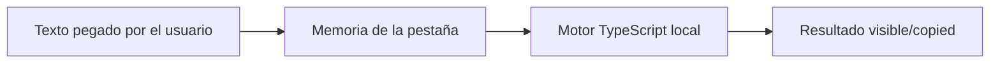

# Privacidad y flujo de datos

- No se ejecuta `fetch`, XHR, WebSocket, beacon ni formularios de red.
- `connect-src 'none'` bloquea conexiones salientes desde la aplicación.
- No hay almacenamiento web, cookies, service worker, analytics ni telemetría.
- Cloudflare Pages recibe únicamente solicitudes de archivos estáticos; no recibe el contenido pegado.
- Recargar o cerrar elimina el estado de la página.
- «Limpiar» sobrescribe todos los campos en memoria.
